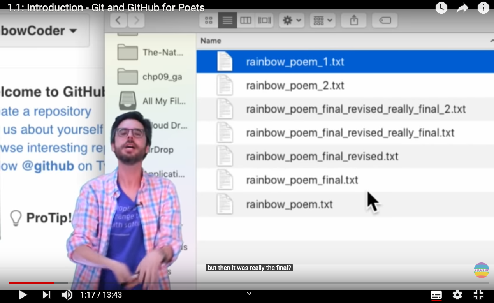

# git?

---

In just hour or so from now we will have:

*  started our git journey <!-- .element: class="fragment" -->
*  collaborated on a github project <!-- .element: class="fragment" -->
*  made a website <!-- .element: class="fragment" -->
*  hosted that website on github pages <!-- .element: class="fragment" -->
*  used the command line to use git <!-- .element: class="fragment" -->

---

---
### Git

*  version control <!-- .element: class="fragment" -->
*  collaboration <!-- .element: class="fragment" -->

***  
<!-- .element: class="fragment" -->

### github <!-- .element: class="fragment" -->

*  a web service to store stuff <!-- .element: class="fragment" -->
*  that uses git behind the scenes <!-- .element: class="fragment" -->

 <!-- .element: class="fragment" -->

---

#### terms:

*  repository  - a place to keep files <!-- .element: class="fragment" -->
*  commit - save <!-- .element: class="fragment" -->
*  branch - alternate version of the repository <!-- .element: class="fragment" -->
*  master - the main branch <!-- .element: class="fragment" -->
*  pull request - asking to take changes back into master <!-- .element: class="fragment" -->
*  fork - create a replica of a repository <!-- .element: class="fragment" -->

---

## part 2

github pages and websites

---

#### what is a website?

[example.com](https://example.com/) <!-- .element: class="fragment" -->

url &rarr; browser &rarr; server &rarr; browser &rarr; done! <!-- .element: class="fragment" -->

---

## part 3

git and the command line

---
<!-- .slide: data-background="images/heart.png" -->
---

#### UNIX commands:

*  'clear' - clean up screen <!-- .element: class="fragment" -->
*  'cd' - go to directory <!-- .element: class="fragment" -->
*  'pwd' - where am i? <!-- .element: class="fragment" -->
*  'ls' - list stuff in current directory <!-- .element: class="fragment" -->
*  'cd ..' - go to parent directory <!-- .element: class="fragment" -->
*  'cd' + tab - go to parent directory <!-- .element: class="fragment" -->
*  up arrow - check command history <!-- .element: class="fragment" -->

---

> we have github. why use git?

---

#### git commands:

*  'git clone' - create a local copy of a repository <!-- .element: class="fragment" -->
*  'git status' - tells us what's going on <!-- .element: class="fragment" -->
*  'git commit -a -m “message”' - commits all changes with a message <!-- .element: class="fragment" -->
*  'git push origin master' - push local changes to remote <!-- .element: class="fragment" -->
*  'git pull origin master' - pull remote changes to local <!-- .element: class="fragment" -->

---

#### links

*  [an excellent tutorial (this one is based on it)](https://www.youtube.com/watch?v=BCQHnlnPusY)
*  [basic git commands/ reference](http://rogerdudler.github.io/git-guide/)
*  [git workflows](https://nvie.com/posts/a-successful-git-branching-model/)
*  [the video where it all clicked for me](https://www.youtube.com/watch?v=HVsySz-h9r4
)
---

thanks

---

<!-- style stuff -->

